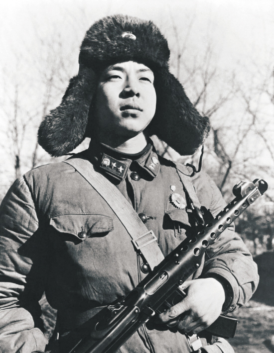

# 个人简历

## 基本信息
- 姓名：Your Name
- 联系方式：Email: your.email@example.com / 手机号码: 123-456-7890
- 地址：City, State, Country

## 教育背景
- 学位：学校名称，学位名称，起止时间
- 学位：学校名称，学位名称，起止时间

## 工作经验
### 公司1
- 职位：职位名称
- 起止时间：起始日期 - 结束日期
- 工作描述：
  - 描述1
  - 描述2

### 公司2
- 职位：职位名称
- 起止时间：起始日期 - 结束日期
- 工作描述：
  - 描述1
  - 描述2

## 论文发表
- 论文1：标题1，期刊/会议名称，发表年份，[下载链接](paper1.pdf)
- 论文2：标题2，期刊/会议名称，发表年份，[下载链接](paper2.pdf)

## 技能
- 技能1
- 技能2
- 技能3

## 项目经验
### 项目1
- 描述：项目描述
- 负责内容：
  - 负责内容1
  - 负责内容2

### 项目2
- 描述：项目描述
- 负责内容：
  - 负责内容1
  - 负责内容2

## 荣誉和奖项
- 荣誉1
- 荣誉2

## 自我评价
在这里写一段简短的自我评价，突出你的特点和优势。
